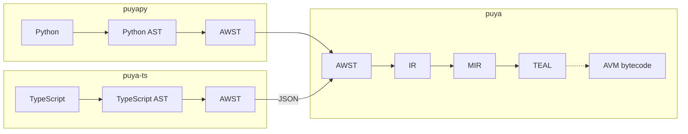
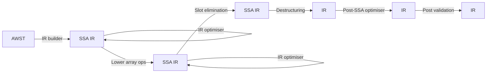

## 0. Context

This document outlines the architecture of the Puya compiler and associated project(s).

It assumes at least a basic level of familiarity with compiler theory and practice.

## 1. Repository overview

This repo currently contains three logical projects:
- [`puya`](/src/puya): the compiler backend, which compiles AWST to TEAL and/or AVM bytecode
- [`puyapy`](/src/puyapy): The Python compiler frontend, which compiles a strict-subset of 
  Python to AWST
- [`algorand-python`](/stubs): the stub (`.pyi`) files defining the Algorand Python interface 
  available.

As of this writing, the `puya` and `puyapy` packages are a single project and packaged together,
in the near future these should be separated.

The frontend for TypeScript is located in a [separate repo](https://github.com/algorandfoundation/puya-ts).

## 2. Architecture overview

The Puya compiler is a multi-language, single-target, multi-stage compiler.

Breaking this down:
- Multi-language: it supports (subsets of) Python and TypeScript as source languages, with 
  support for other languages being possible to add in the future. It was designed to work with Python 
  initially, but abstracted such that other languages would be possible - this is the purpose 
  of the AWST layer.
- Single target: it is designed to produce code to run on the Algorand Virtual Machine only - 
  whether this is as TEAL or as AVM byte code.
- Multi-stage: this is as opposed to a [one-pass compiler](https://en.wikipedia.org/wiki/One-pass_compiler). 
  The stages function as a pipeline, with each program passing sequentially through each stage.

At a high level, the pipeline is as follows:

Each layer may contain multiple sub-passes within, in particular the IR layer is where the majority
of optimizations occur.

As in any sort of processing pipeline, each step (or layer, in this case) should only depend upon 
the results of previous steps, not future steps. This is somewhat complicated by the combination
of supporting template variables and cross-contract compilation references, but from the viewpoint
of an individual program, this principle is upheld.

Also, ideally, each layer should depend solely on the results of the previous layer - at least as
far as the core models are concerned. Some metadata models are shared between layers.

The process of taking the results of one layer, processing it, and returning the new result is
sometimes referred to as "lowering", since at each step, we peel away more of the abstractions
of the source language(s) until producing the final output (TEAL or bytecode) becomes almost trivial.

## 3. Frontends

The canonical three stage compiler architecture typically consists of the following stages:

1. **Front-end**: This stage focuses on the analysis part of compiling. It includes lexical
   analysis (tokenizing the input source code), syntax analysis (parsing tokens to generate a
   syntax tree), and semantic analysis (ensuring the code adheres to language rules and type
   constraints). The front-end eventually generates an intermediate representation (IR) of the
   source code.

2. **Middle-end**: This stage takes the IR generated by the front-end and optimizes it. 
   The goal is to improve the performance and efficiency of the code without changing its semantics.

3. **Back-end**: This stage is responsible for the transformation of the optimized IR into the 
   target code, typically machine code or bytecode.

The technical definition of what constitutes an IR is a bit hard to nail down, but the following
properties should be fairly uncontroversial:
- It is a semantically equivalent representation of the complete input program.
- It is independent of the source language.

By this definition, the AWST that serves as the output of a frontend to puya is an IR, despite 
being - as the name implies - structured similarly to an AST. The key distinction is that the AWST
is intended to be a representation that is straight-forward to translate an AST into, but without
any source language specifics. 

### puyapy

The `puyapy` program takes `.py` file(s) containing "Algorand Python" - a 
[strict subset of the full Python language](https://algorandfoundation.github.io/puya/language-guide.html),
and produces AWST.

Since Algorand Python has the same grammar as CPython, parsing makes use of the builtin 
[`ast`](https://docs.python.org/3/library/ast.html)
module. As well as reducing the amount of code in this front-end, this has the nice property of 
ensuring that there are no parsing differences with CPython, and parsing new language elements is
automatically supported - even if using those elements is not supported.

> [!NOTE]
> This is currently only true indirectly - parsing makes use of the 
> [mypy](https://github.com/python/mypy) project, which in turn uses `ast`. 
> In the near future, this dependency will be removed, and all type checking and inference will be 
> handled by `puyapy`.

The entry-point for `puyapy` is in [src/puyapy/__main__.py](/src/puyapy/__main__.py). From there,
`compile_to_teal` in [src/puyapy/compile.py](src/puyapy/compile.py) is invoked, which drives the 
overall compilation process. Since both `puyapy` and `puya` are written in Python, the
`puya` package is imported and invoke it directly.

### puya-ts

Please see the [puya-ts](https://github.com/algorandfoundation/puya-ts) repo for any relevant 
architecture documentation. 

The key difference between `puyapy` and `puya-ts` is that since it is implemented 
in TypeScript (in order to take advantage of the native TypeScript compiler API, similar to how 
`puyapy` takes advantage of the Python `ast` module), it serializes the AWST data structure as well
to pass to the `puya` executable. The CLI for the `puya` is deliberately quite simple, since it's
not meant for end user consumption. Along with the AWST JSON, it also takes an optional JSON file
containing the source code at the time of compilation, and a mandatory "control" file, which
specifies options, what to compile, etc. See [`src/puya/__main__.py`](/src/puya/__main__.py) for 
the entry point here.

### 3rd Party Front Ends

Puya has been architected in a way to support additional front end languages, allowing them to take
advantage of the compilation and optimizations of the backend layers. Please see the [Building a front end for Puya](docs/front-end-guide/readme.md) docs for a guide to contributing your own front end.

## 4. Backend Layers

Although "backend" would, in the three stage architecture noted above, imply everything after the
optimization stage, we use this term to refer to `puya` here. 

### AWST: Abstract Wyvern Syntax Tree

The project to build this compiler was initially codenamed Wyvern, and the W has stuck around.

Since the AWST serves as the starting point for the backend, the executable code contained in this
layer mostly revolves around validation and also the [visitor pattern](https://craftinginterpreters.com/representing-code.html#the-visitor-pattern).

The model definitions in [puya.awst.nodes](/src/puya/awst/nodes.py) contain validation which 
can be done without looking at a larger program context - the latter being located in
[puya.awst.validation](/src/puya/awst/validation/).

The type system is defined in [puya.awst.wtypes](/src/puya/awst/wtypes.py).

"An AWST" refers to a collection of `RootNode`s - either a `Contract`, `LogicSignature` or `Subroutine`.
`Contract`s and `LogicSignature`s are eligible as compilation targets (ie they generate program(s)),
`Subroutine` objects are included at the top level as they may be referenced by multiple programs.

### IR: Intermediate Representation

Entry point: [puya.ir.main](/src/puya/ir/main.py).

The core model for the IR layer is a hybrid model: linear ["basic blocks"](https://en.wikipedia.org/wiki/Basic_block) 
with a control flow graph (CFG).

The IR is constructed directly into static single assignment (SSA) form - see [puya.ir.ssa](/src/puya/ir/ssa.py)
for relevant literature references.

The control flow (directed) graph is embedded in the basic blocks as an adjacency list, along with
it's inverse. The former occurs naturally, since the terminating op contains references to
successor block(s), whereas the latter must be maintained manually.

The IR layer is a pipeline in itself, with multiple lowerings and optimisation rounds:

The ARC-4 routing logic currently occurs [within the IR layer](/src/puya/ir/arc4_router.py), 
but constructs AWST.

### MIR: Memory IR

Entry point: [puya.mir.main](/src/puya/mir/main.py).

In lowering from IR to MIR, we peel back the memory-model abstractions. Each IR `Register` gets
allocated to some portion of the stack, and any remaining slot operations are resolved to point to 
either a static scratch slot ID or to be allocated at runtime.

MIR retains the CFG/basic block structure of the IR. No control flow optimisations are done, and
only minimal peephole optimisations are performed at this level - those that require information
about variable lifetimes and logical load/store semantics, as these are not as easy to discern 
once the conversion to TEAL ops takes place.

In the initial phase of IR to MIR conversion, reads/write to `Registers` are replaced with abstract
store and load operations. Then, through successive rounds of allocations, these abstract stores
and loads are replaced with equivalents for a specific stack region.

The complexity of scheduling registers to stack regions revolves around control-flow join points.
For example, after an if/else construct, if both code paths don't assign the exact same set of
live variables, then the stack would become unbalanced, and tracking the stacks logical contents
would become a runtime concern. Within such a restricted computing environment as the AVM, this is
not a practical option.

Instead, we use a global stack allocation algorithm that ensures that we know exactly what the 
stack holds on basic-block entry, regardless of which control flow path via by which we arrived.
The approach is loosely based on [this paper](http://www.euroforth.org/ef06/shannon-bailey06.pdf).
In particular, as of this writing, the Koopmans and Baileys passes are implemented, however the 
subroutine-global stack allocation is not, instead any remaining variables are stored in the frame.

### TEAL

Entry point: [puya.teal.main](/src/puya/teal/main.py).

The MIR to TEAL lowering is mostly a straight-forward translation, that takes the output of the MIR
and performs the necessary bookkeeping to translate concrete store/loads into actual TEAL ops. It
also loses the basic-block structure, since most TEAL control flow ops have a fall through case.
e.g., a `ConditionalBranch` gets turned into a `bnz` or `bz` and then a `b`.

Once the initial conversion is done, the final round of optimisations takes place. These are mostly
peephole optimisations, with the exception of constant gathering, which analyzes the whole program
to produce `intcblock` and `bytecblock` instructions.

### AVM bytecode

Entry point: [puya.ussemble.main](/src/puya/ussemble/main.py).

This layer is named `ussemble` because if you say it right/wrong it sounds like "assemble", but
by starting with a `u` all the layers occur in alphabetical order, which is actually rather helpful
when finding your way around the code.

This layer produces AVM byte code and also debug mappings. It doesn't perform any optimisations,
so that the TEAL output produced in the previous layer should produce identical byte code if 
assembled by either `puya` or `algod`.
