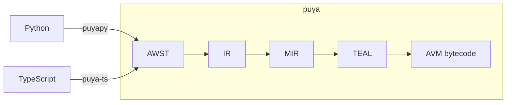

## Repository overview 

This repo currently contains three logical projects:
- [`puya`](/src/puya): the compiler backend, which compiles AWST to TEAL and/or AVM bytecode
- [`puyapy`](/src/puyapy): The Python compiler frontend, which compiles a strict-subset of 
  Python to AWST
- [`algorand-python`](/stubs): the stub (`.pyi`) files defining the Algorand Python interface 
  available.

As of this writing, the `puya` and `puyapy` packages are a single project and packaged together,
in the near future these should be seperated.

The frontend for TypeScript is located in a [separate repo](https://github.com/algorandfoundation/puya-ts).

## Architecture overview

The Puya compiler is a multi-langauge, single-target, multi-stage compiler.

Breaking this down:
- Multi langauge: it supports (subsets of) Python and TypeScript as source languages, with 
  support for other languages being possibly to add in the future. It was designed to work with Python 
  initially, but abstracted such that other languages would be possible - this is the purpose 
  of the AWST layer.
- Single target: it is designed to produce code to run on the Algorand Virtual Machine only - 
  whether this is as TEAL or as AVM byte code.
- Multi stage: this is as opposed to a [one-pass compiler](https://en.wikipedia.org/wiki/One-pass_compiler). 
  The stages function as a pipeline, with each program passing sequentially through each stage.

At a high level, the pipeline is as follows:

```mermaid
flowchart LR;
    Python-->|puyapy|AWST;
    TypeScript-->|puya-ts|AWST;
    subgraph puya
    AWST-->IR;
    IR-->MIR;
    MIR-->TEAL;
    TEAL-.->bytecode["AVM bytecode"];
    end
```

Each layer may contain multiple sub-passes within, in particular the IR layer is where the majority
of optimizations occur.

As in any sort of processing pipeline, each step (or layer, in this case) should only depend upon 
the results of previous steps, not future steps. This is somewhat complicated by the combination
of supporting template variables and cross-contract compilation references, but from the viewpoint
of an individual program, this principle is upheld.

Also, ideally, each layer should depend solely on the results of the previous layer - at least as
far as the core models are concerned. Some metadata models are shared between layers.

The process of taking the results of one layer, processing it, and returning the new result is
sometimes referred to as "lowering", since at each step, we peel away further of the abstractions
of the source language(s) until producing the final output (TEAL or bytecode) becomes almost trivial.

### puyapy

The `puyapy` program takes `.py` file(s) containing "Algorand Python" - a [strict subset of the full Python language](https://algorandfoundation.github.io/puya/language-guide.html)
and produces `AWST`. 

In a canonical multi-stage compiler, the first steps are generally "lexing" (or tokenization),
followed by "parsing", to produce an Abstract Syntax Tree (AST).

Since Algorand Python has the same grammar as CPython, we make use of the builtin [`ast`](https://docs.python.org/3/library/ast.html)
module. As well as reducing the amount of code in this front-end, this has the nice property of 
ensuring that there are no parsing differences with CPython, and parsing new langauge elements is
automatically supported - even if we don't support using those elements.

> [!NOTE]
> This is currently only true indirectly - we make use of the [mypy](https://github.com/python/mypy) 
> project, which in turn uses `ast`. In the near future, this dependency will be removed, and all
> type checking and inference will be handled by `puyapy`.

The entry-point for `puyapy` is in [src/puyapy/__main__.py](/src/puyapy/__main__.py). From there,
`compile_to_teal` in [src/puyapy/compile.py](src/puyapy/compile.py) is invoked, which drives the 
overall compilation process. Since both `puyapy` and `puya` are written in Python, we import the
`puya` package and invoke it directly.

### puya-ts

Please see the [puya-ts](https://github.com/algorandfoundation/puya-ts) repo for any relevant 
architecture documentation. 

The key difference between `puyapy` and `puya-ts` is that `puya-ts` is that since it is implemented 
in TypeScript (in order to take advantage of the native TypeScript compiler API, similar to how 
`puyapy` takes advantage of the Python `ast` module), it serializes the AWST data structure as well
to pass to the `puya` executable. The CLI for the `puya` is deliberately quite simple, since it's
not meant for end user consumption. Along with the AWST JSON, it also takes an optional JSON file
containing the source code at the time of compilation, and a mandatory "control" file, which
specifies options, what to compile, etc. See [`src/puya/__main__.py`](/src/puya/__main__.py) for 
the entry point here.

### AWST: Algorand Whittled Syntax Tree

### IR: Intermediate Representation

### MIR: Memory IR

### TEAL

### AVM bytecode
