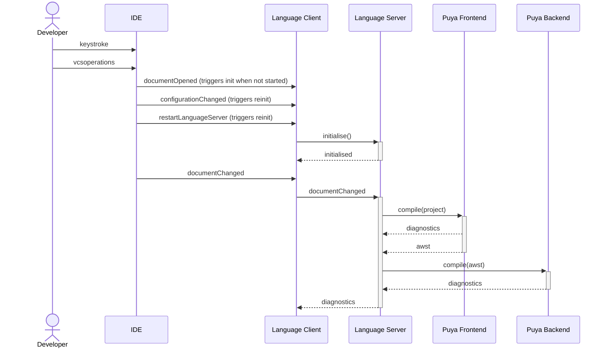
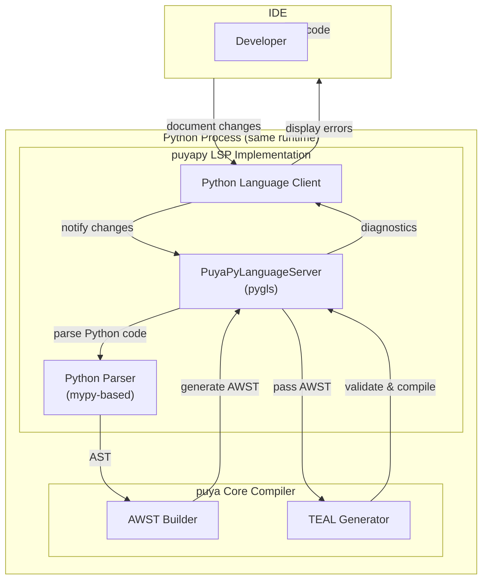
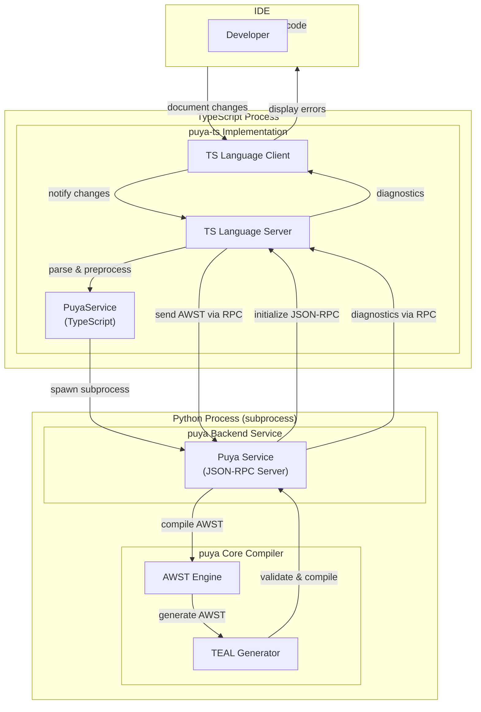

# Language Server

This document outline the architecture of the Puya Language Server capability.

```mermaid
sequenceDiagram
  actor D as Developer
  participant IDE as IDE
  participant LC as Language Client
  participant LS as Language Server
  participant PF as Puya Frontend
  participant PB as Puya Backend
  D ->> IDE: keystroke
  D ->> IDE: vcsoperations
  IDE ->> LC: documentOpened (triggers init when not started)
  IDE ->> LC: configurationChanged (triggers reinit)
  IDE ->> LC: restartLanguageServer (triggers reinit)
  LC ->>+ LS: initialise()
  LS -->>- LC: initialised
  IDE ->> LC: documentChanged
  LC ->>+ LS: documentChanged
  LS ->>+ PF: compile(project)
  PF -->> LS: diagnostics
  PF -->>- LS: awst
  LS ->>+ PB: compile(awst)
  PB -->>- LS: diagnostics
  LS -->>- LC: diagnostics
```

## Python 'Frontend' Implementation

```mermaid
flowchart TB
    subgraph IDE["IDE"]
        Dev["Developer"]
    end
    
    subgraph "Python Process (same runtime)"
        subgraph "puyapy LSP Implementation"
            PLC["Python Language Client"]
            PLS["PuyaPyLanguageServer\n(pygls)"]
            Parser["Python Parser\n(mypy-based)"]
        end
        
        subgraph "puya Core Compiler"
            AWSTB["AWST Builder"]
            TEAL["TEAL Generator"]
        end
    end
    
    Dev -->|edit code| IDE
    IDE -->|document changes| PLC
    PLC -->|notify changes| PLS
    PLS -->|parse Python code| Parser
    Parser -->|AST| AWSTB
    AWSTB -->|generate AWST| PLS
    PLS -->|pass AWST| TEAL
    TEAL -->|validate & compile| PLS
    PLS -->|diagnostics| PLC
    PLC -->|display errors| IDE
    
    class IDE ide
    class PLC,PLS,Parser puyapy
    class AWSTB,TEAL core
```

## TypeScript 'Frontend' Implementation

```mermaid
flowchart TB
    subgraph IDE["IDE"]
        Dev["Developer"]
    end
    
    subgraph "TypeScript Process"
        subgraph "puya-ts Implementation"
            TLC["TS Language Client"]
            TLS["TS Language Server"]
            PSTS["PuyaService\n(TypeScript)"]
        end
    end
    
    subgraph "Python Process (subprocess)"
        subgraph "puya Backend Service"
            PS["Puya Service\n(JSON-RPC Server)"]
        end
        
        subgraph "puya Core Compiler"
            AWSTB["AWST Engine"]
            TEAL["TEAL Generator"]
        end
    end
    
    Dev -->|edit code| IDE
    IDE -->|document changes| TLC
    TLC -->|notify changes| TLS
    TLS -->|parse & preprocess| PSTS
    PSTS -->|spawn subprocess| PS
    PS -->|initialize JSON-RPC| TLS
    TLS -->|send AWST via RPC| PS
    PS -->|compile AWST| AWSTB
    AWSTB -->|generate AWST| TEAL
    TEAL -->|validate & compile| PS
    PS -->|diagnostics via RPC| TLS
    TLS -->|diagnostics| TLC
    TLC -->|display errors| IDE
    
    class IDE ide
    class TLC,TLS,PSTS tsImpl
    class PS pyService
    class AWSTB,TEAL core
```
