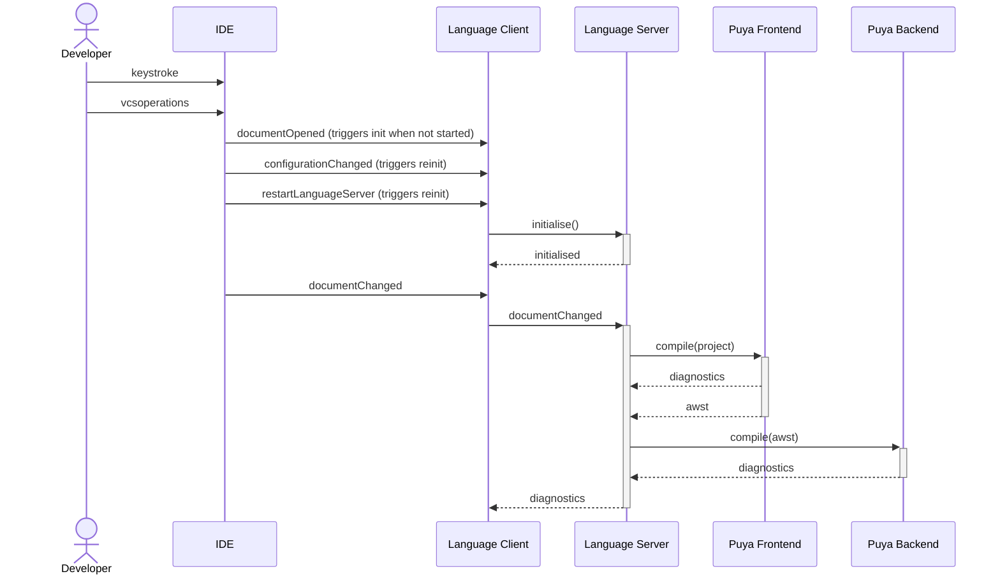
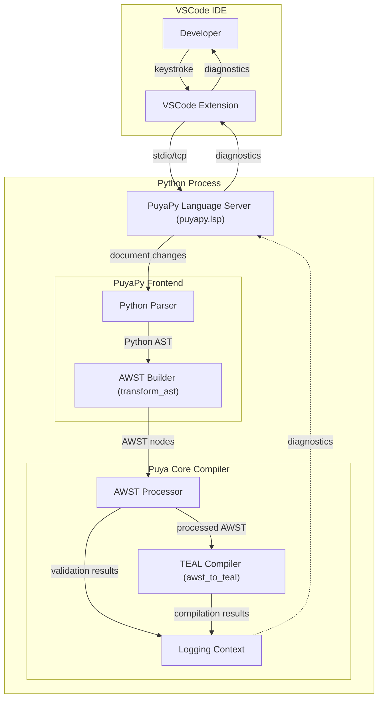
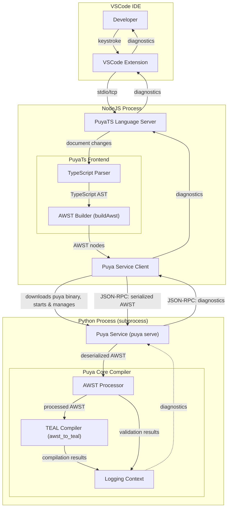

# Language Server

This document outline the architecture of the Puya Language Server capability.

## Algorand Python Language Server

The Python implementation of the Puya language server directly interacts with the Puya compiler components in the same Python process.

## Algorand TypeScript Language Server

The TypeScript implementation runs the Puya service as a separate process and communicates with it via JSON-RPC over stdin/stdout.

