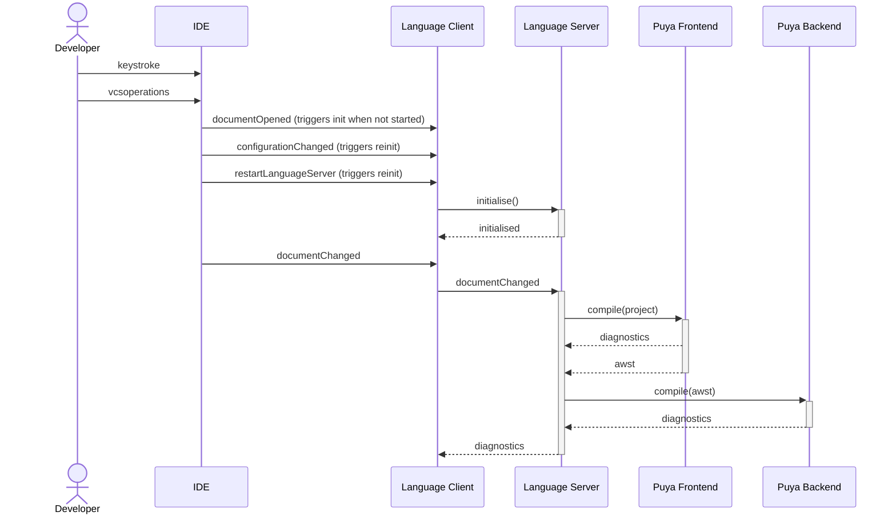

# Language Server

This document outline the architecture of the Puya Language Server capability.

```mermaid
sequenceDiagram
  actor D as Developer
  participant IDE as IDE
  participant LC as Language Client
  participant LS as Language Server
  participant PF as Puya Frontend
  participant PB as Puya Backend

  D ->> IDE: keystroke
  D ->> IDE: vcsoperations
  IDE ->> LC: documentOpened (triggers init when not started)
  IDE ->> LC: configurationChanged (triggers reinit)
  IDE ->> LC: restartLanguageServer (triggers reinit)
  LC ->>+ LS: initialise()
  LS -->>- LC: initialised
  IDE ->> LC: documentChanged
  LC ->>+ LS: documentChanged
  LS ->>+ PF: compile(project)
  PF -->> LS: diagnostics
  PF -->>- LS: awst
  LS ->>+ PB: compile(awst)
  PB -->>- LS: diagnostics
  LS -->>- LC: diagnostics
```
